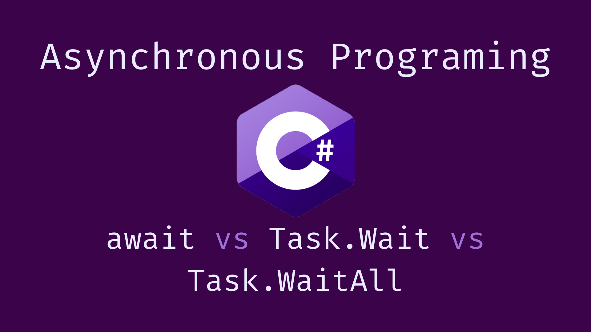

Async programming is a paradigm that allows us to run multiple tasks concurrently with other tasks without blocking the execution flow. This technique is very useful for performing tasks that take a long time to complete. Because these tasks do not block the main thread, they increase application performance.

In asynchronous programming, we utilize the **await** keyword and the **Task.Wait()** and **Task.WaitAll()** methods. While these methods may seem similar, there are significant differences. This article will explore the distinctions between **await**, **Task.Wait()**, and **Task.WaitAll()**.

### await Keyword
Using this keyword initiates the task asynchronously, meaning it operates on a separate thread or subsystem without blocking the main thread. When this keyword is employed, the code pauses until the task concludes on the other thread, allowing the main thread to process other tasks concurrently.

#### Usage-1
```cs
var result = await DoSomethingAsync();
```
This usage pauses the execution of the current method at this line of code until the task completes. However, it doesn’t block the main thread, allowing it to continue executing other operations.

#### Usage-2
```cs
var task = DoSomethingAsync();
```
This usage starts the asynchronous task without pausing the current method, allowing subsequent code to execute immediately. The task runs in the background, freeing the main thread to perform other operations concurrently.

### Task.Wait()
Unlike await, `Task.Wait()` converts asynchronous code to synchronous by blocking the main thread until the task completes.

#### Usage
```cs
var task = DoSomethingAsync();
task.Wait();
var result = task.Result;
```
Be careful when using this method because it will block the main thread until it completes the task, preventing any other operations until the main thread is released.

#### Task.Result
```cs
var task = DoSomethingAsync();
var result = task.Result;
//OR
var task = DoSomethingAsync().Result;
```
Accessing Task.Result works similarly to `Task.Wait()`, blocking the main thread until the task completes.

### Task.WaitAll()
While `Task.WaitAll()` accepts multiple tasks and allows them to execute asynchronously, the method itself runs synchronously, blocking the main thread until all tasks have completed.
```cs
Task.WaitAll(task1,task2,task3, ....);
```
Again, this method blocks the main thread and waits synchronously until all tasks are completed but it executes the tasks asynchronously.

Thanks.