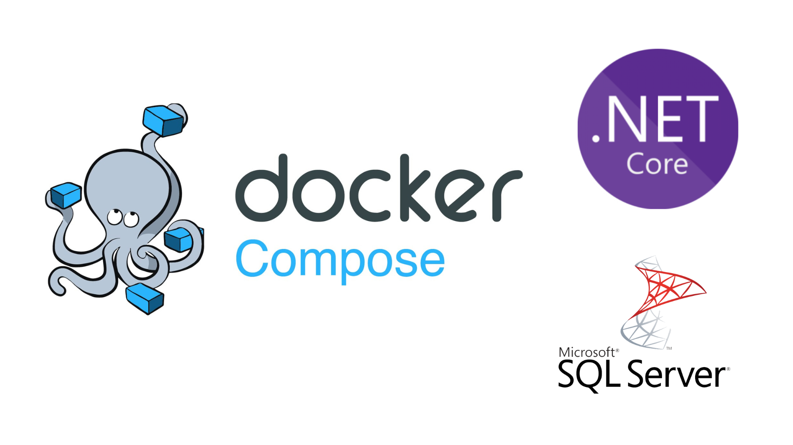
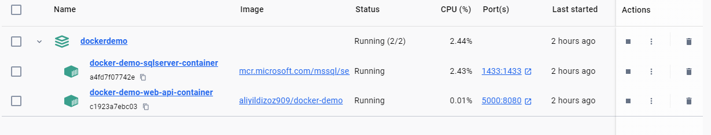
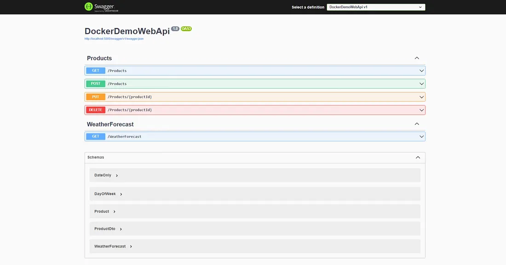
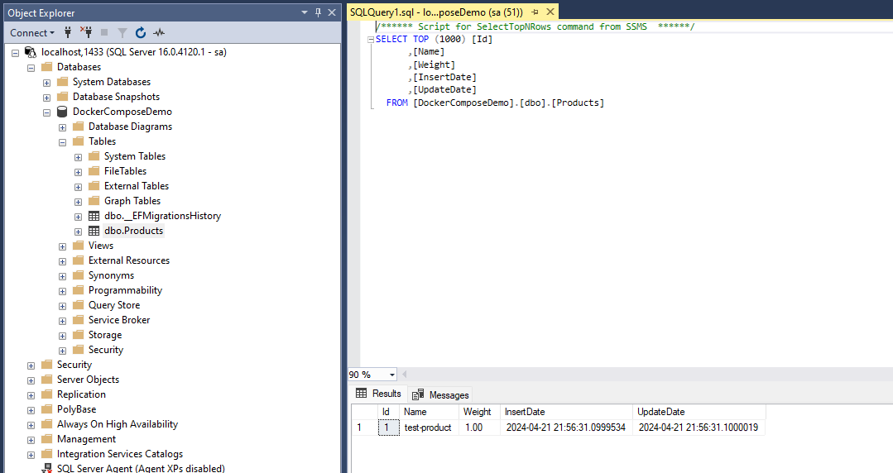

Docker Compose is a tool that helps us run multiple containers together in harmony with one command. With this tool, we can easily test and preview our applications very quickly. We just define our services(containers), volumes, and networks in this file; Docker creates them for us. Docker Compose is usually used for development and testing, but with each release, Docker is making progress on more production-oriented features, too.

In this blog, I explain how to connect an Asp.Net Core Web API application to an MSSQL database in a docker container environment.

I created the application. It performs crud operations on a table. You can view the application from [here](https://github.com/aliyildizoz/DockerDemo/tree/docker-compose-demo).

### Connection String Configuration
If we consider that our connection be changed in the production, we must create another appsettings file for the production. So, below, I added a `ConnectionString` section in the `appsettings.Production.json` file.

```json
{
  "Logging": {
    "LogLevel": {
      "Default": "Information",
      "Microsoft.AspNetCore": "Warning"
    }
  },
  "ConnectionStrings": {
    "DefaultConnection": "Server=docker-demo-sqlserver,1433;Database=DockerComposeDemo;User=sa;Password={0};TrustServerCertificate=True"
  }
}
```
The most important feature of docker-compose is connecting with other containers using their names. Docker provides a DNS service for us here. So here in the Connection string, I use the default port number of the SQL server image and use `docker-compose-demo-sqlserver` as the server name. I use this name as the name of the SQL server service within the docker-compose file in the following part.

Because of security vulnerabilities, we shouldn’t add the SQL server password into the app settings. In this example, we create an environment variable for the password and provide it dynamically when it runs.

```cs
builder.Services.AddDbContext<DockerComposeDemoDbContext>(
                       options =>
                       {
                           var connectionString = builder.Configuration.GetConnectionString("DefaultConnection");
                           if (!builder.Environment.IsDevelopment())
                           {
                               var password = Environment.GetEnvironmentVariable("MSSQL_SA_PASSWORD");
                               connectionString = string.Format(connectionString, password);
                           }
                           options.UseSqlServer(connectionString);

                       });
```
As you see, we first check the environment. If it is not Development, we provide the password from the environment variable called `MSQL_SA_PASSWORD`. The app provides the connection string to our DbContext at runtime, so we don’t have to add the password in the app settings.

#### Migration at startup
I apply migration and create the database at runtime. For that, I add the following code to the Program.cs file before the application is launched. When the app runs, it first creates our Database.

```c#
using (var scope = app.Services.CreateScope())
{
    var db = scope.ServiceProvider.GetRequiredService<DockerComposeDemoDbContext>();
    db.Database.Migrate();
}
app.Run();
```

### Docker-Compose File
Docker-Compose files allow us to build our Dockerfiles by specifying the build context and Dockerfile path, too. In our example, we use the image from the registry. I add it to the Docker hub; you can check the repository here [aliyildizoz909/docker-demo](https://hub.docker.com/r/aliyildizoz909/docker-demo).

```yaml withLineNumbers
version: '3.8'

services:
  docker-demo-web-api:
    container_name: docker-demo-web-api-container
    image: aliyildizoz909/docker-demo
    environment:
      - MSSQL_SA_PASSWORD=Password1*
    ports:
      - "5000:8080"
    depends_on:
      - docker-demo-sqlserver    
  docker-demo-sqlserver:
    container_name: docker-demo-sqlserver-container
    image: mcr.microsoft.com/mssql/server:2022-latest
    environment:
      - ACCEPT_EULA=Y
      - MSSQL_SA_PASSWORD=Password1*
    ports:
      - "1433:1433"
```

We have two services here: the first one configures our web API, and the second one configures the SQL server.

#### docker-demo-web-api service

```yaml
docker-demo-web-api:
    container_name: docker-demo-web-api-container
    image: aliyildizoz909/docker-demo
    environment:
      - MSSQL_SA_PASSWORD=Password1*
    ports:
      - "5000:8080"
    depends_on:
      - docker-demo-sqlserver    
```
* `container_name: docker-demo-web-api-container` : We set the container name as `docker-demo-web-api-container`
* `image: aliyildizoz909/docker-demo` : We specify the image source as [aliyildizoz909/docker-demo](https://hub.docker.com/r/aliyildizoz909/docker-demo).
* `MSSQL_SA_PASSWORD=Password1*` : Under the environment section, we set the `MSSQL_SA_PASSWORD` environment variable. This variable’s value and the variable's value with the same name under `docker-demo-sql-server` service should be the same. Otherwise, we cannot access the SQL server in the container. The variable's name is another important thing we should be careful about. We must use the same variable name when we get the password in our application.
* `"5000:8080"` : Here, we did a port publish. When we go to the **5000** port via localhost, we tell the docker to redirect the requests to the **8080** port in the `docker-demo-web-api` container. **8080** port is the default port of our published app in the container for asp.net core apps. You can change it via the `ASPNETCORE_URLS` environment variable or with the new one `ASPNETCORE_HTTP_PORTS` . [See more information](https://learn.microsoft.com/en-us/dotnet/core/compatibility/containers/8.0/aspnet-port).
* `depends_on` This section defines the priority of services to run. We add here which services we want to run before the current service. So, in our example, we add `docker-demo-sqlservice` here to run our application after the SQL server is ready.

#### docker-demo-sqlserver service

```yaml
  docker-demo-sqlserver:
    container_name: docker-demo-sqlserver-container
    image: mcr.microsoft.com/mssql/server:2022-latest
    environment:
      - ACCEPT_EULA=Y
      - MSSQL_SA_PASSWORD=Password1*
    ports:
      - "1433:1433"
```
* `container_name: docker-demo-sqlserver-container` : We set the container name as `docker-demo-sqlserver-container`
* `image: mcr.microsoft.com/mssql/server:2022-latest` : We specify the image source as [mcr.microsoft.com/mssql/server:2022-latest](https://hub.docker.com/_/microsoft-mssql-server)
* `ACCEPT_EULA` and `MSSQL_SA_PASSWORD` are mandatory environment variables for this image. `ACCEPT_EULA=Y` means that we confirm acceptance of the [End-User Licensing Agreement](https://go.microsoft.com/fwlink/?linkid=857698). `MSSQL_SA_PASSWORD` environment variable sets the password for the database system administrator (user-id = ‘sa’) to connect to the SQL Server once the container runs.
* `"1433:1433"` 1433 port is the default port for the SQL server. So here, we mapped the host port number(1433) and the container port number(1433).


### Running Docker-Compose File
With the following command, we run our docker-compose file.
```
docker compose up
```
After running this command, we access our application here http://localhost:5000





You can also check my blog [Understanding Asp.Net Core Dockerfile](/understanding-asp-net-core-dockerfile) if you want to understand how the Dockerfile works and the Dockerfile of this image([aliyildizoz909/docker-demo](https://hub.docker.com/r/aliyildizoz909/docker-demo)).

Thank you.