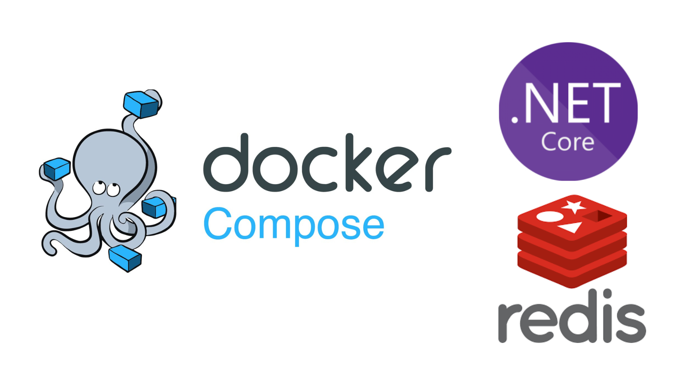
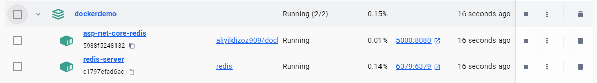
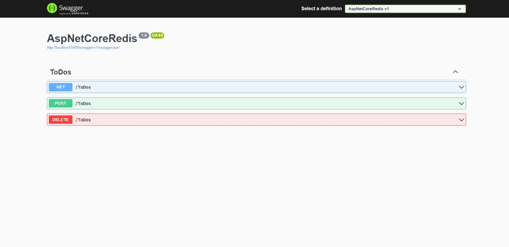

Caching is one of the important subjects in the software field. For reducing our application response time and improve the performance, caching is a very helpful tool.

There are two types of caching mechanisms.

* **In-Memory Caching:** The data are kept in the host’s memory on which the application resides.
* **Distributed Caching:** The data are kept on a different server in which the application doesn’t reside.

Redis is a Distributed Caching tool. There are some advantages and disadvantages for both caching mechanisms but I won’t explain them in this article. In this article, I will show you how to create a docker-compose file for an application that uses Redis.

### Example Application
Our application will be a basic to-do application. It will perform read, add, and remove operations on the cache.

There are many libraries to use Redis in Asp.Net Core applications. In our example, we will use **StackExchange.Redis** library.

#### StackExchange.Redis
This is the most popular NuGet package for utilizing Redis with full functionality. It provides access to all redis-cli commands, it is very useful for complex scenarios. However, the implementation may be slightly more difficult compared to other methods. It may require setting up a Redis service and configuring the connection to the Redis server. This package uses the IDatabase interface for executing Redis commands.

#### appsettings.Production.json

```json
  "RedisOption": {
    "Configuration": "redis-server",
    "DefaultDatabase": 0
  }
```

I added a RedisOption section to the appsettings. The Redis service in our docker-compose file is named `redis-server`, so I’ve configured the Redis server name accordingly. There are many databases numbered in the Redis server, I used `0` database as the default.

#### RedisService
```cs
 public class RedisService
 {
     private ConnectionMultiplexer _redis;

     public IDatabase Database { get; set; }
     public RedisService(IConfiguration configuration)
     {
         _redis = ConnectionMultiplexer.Connect(configuration.GetValue<string>("RedisOption:Configuration"));
         Database = _redis.GetDatabase(configuration.GetValue<int>("RedisOption:DefaultDatabase"));
     }

     public IDatabase GetDatabase(int db)
     {
         return _redis.GetDatabase(db);
     }
 }
```
I implemented a service to carry out general operations for Redis. Initially, it establishes a connection to Redis and then sets the default database.

#### Program.cs
```c#
builder.Services.AddSingleton<RedisService>();
builder.Services.AddSingleton<IDatabase>(x =>
{
    var redisService = x.GetService<RedisService>();
    return redisService.Database;
});
```
I registered `RedisService` and `IDatabase` as singletons to be accessible in the controllers.


#### ToDosController

```c#
    [HttpGet]
    public async Task<IEnumerable<string>> GetAsync()
    {
        if (_database.KeyExists(ToDosKey))
        {
            var cacheValue = await _database.ListRangeAsync(ToDosKey);
            return cacheValue.Select(x => x.ToString());
        }

        return [];
    }

    [HttpPost]
    public async Task<string> PostAsync(string todo)
    {
        await _database.ListRightPushAsync(ToDosKey, todo);
        return todo;
    }

    [HttpDelete]
    public async Task<string> DeleteAsync(string todo)
    {
        await _database.ListRemoveAsync(ToDosKey, todo);
        return todo;
    }
```
We have a controller here for testing Redis. It essentially uses the [Redis List type](https://redis.io/docs/latest/develop/data-types/lists/) to retrieve todos from the cache, adds a todo to the cache, and removes them from the cache.

You can see the app from [here](https://github.com/aliyildizoz/DockerDemo/tree/docker-compose-redis-demo).

---

### Docker-Compose File
Actually, integrating Redis into a Docker container for use with an Asp.Net Core application, or any other application, is quite straightforward. You just have to make sure that the Redis service name in the docker-compose file corresponds with the Redis server’s configuration name in your application’s connection settings.

```yaml withLineNumbers
version: '3.8'

services:
  asp-net-core-redis:
    container_name: asp-net-core-redis
    image: aliyildizoz909/docker-demo-redis
    ports:
      - "5000:8080"
    depends_on:
      - redis-server   
  redis-server:
    container_name: redis-server
    image: redis
    ports:
      - "6379:6379"
```

We have two services here our Web API application and Redis server.

#### asp-net-core-redis

```yaml
asp-net-core-redis:
    container_name: asp-net-core-redis
    image: aliyildizoz909/docker-demo-redis
    ports:
      - "5000:8080"
    depends_on:
      - redis-server   
```
* `container_name: asp-net-core-redis` : We set the container name as `asp-net-core-redis`
* `image: aliyildizoz909/docker-demo-redis` : We specify the image source as [aliyildizoz909/docker-demo-redis](https://hub.docker.com/r/aliyildizoz909/docker-demo-redis).
* `"5000:8080"` : Here, we did a port publish. When we go to the **5000** port via localhost, we tell the docker to redirect the requests to the **8080** port in the `asp-net-core-redis` container. **8080** port is the default port of our published app in the container for asp.net core apps. You can change it via the `ASPNETCORE_URLS` environment variable or with the new one `ASPNETCORE_HTTP_PORTS` . [See more information](https://learn.microsoft.com/en-us/dotnet/core/compatibility/containers/8.0/aspnet-port).
* `depends_on` This section defines the priority of services to run. We add here which services we want to run before the current service. So, in our example, we add `redis-server` here to run our application after the Redis server is ready.

#### redis-server

```yaml
  redis-server:
    container_name: redis-server
    image: redis
    ports:
      - "6379:6379"
```
* `container_name: redis-server` : We set the container name as `redis-server`
* `image: redis` :We specify the image source as [redis](https://hub.docker.com/_/redis).
* `5672:5672`: These ports represent the Redis server.

### Running Docker-Compose File
To run our Docker-Compose setup, use the following command from the directory containing your `docker-compose.yml` file
```
docker compose up
```
After running this command, we can access our application here http://localhost:5000

#### Docker Desktop


#### Swagger View


Thank you.