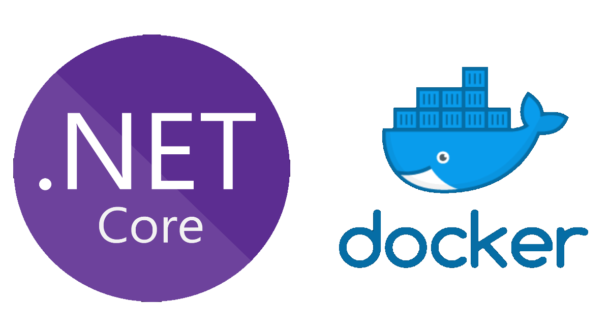
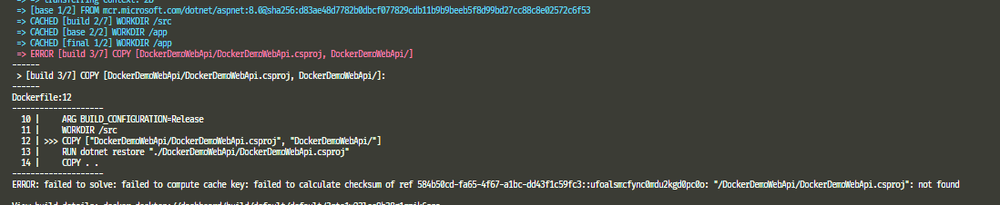
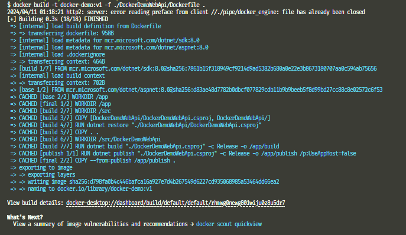

Before starting, the header can be misleading :) When I started writing this blog, I planned to take over Dockerfile for only Asp.Net Core-related parts. However, after I began to write, I realized that the Asp.Net Core parts are only 20% of the Dockerfile. So, I decided to change the blog course to understand the whole process of Dockerfile build. 




## Dockerfile Build Process
A Dockerfile is a file that includes instructions under each other. In other words, it is a set of instructions. Docker reads and builds these files to create images and later uses these images to create containers.

### But how it works?
When we build a Dockerfile, Docker starts many processes from the first line to the end of the lines. Every line corresponds to an image layer, using the previous layer as a base image. Docker also caches every layer in this process to avoid building the unchanged layers again. With this cache mechanism, Docker reduces the build time.

### Docker build steps
1. In the first step, Docker reads the first line and pulls(if it does not exist) the specified base image from a registry during the `FROM` instruction process. 
2. If there are execution instructions in the Dockerfile, such as `RUN`, `COPY` or `ADD` Docker creates a temporary container from the previous image layer and executes these instructions in this container. After it completes the executions, Docker captures the changes in the temporary container and creates a new image layer from these changes. After the layer is created, Docker removes these temporary containers. 
3. If a multi-stage build is involved and the stages don't depend on each other, Docker builds every stage in parallel.
4. After Docker creates layers for each line, it tags these layers with a final image.

Because of the cash mechanism, the order of instructions is very important. When creating a Dockerfile, we should first add the instructions that are less likely to change.

For example, we have a Dockerfile as below.

```none
FROM scratch
COPY src .
EXPOSE 80
```

We built this file, and Docker started to cache every line. Later, we needed to change our source files and rebuild the image. In this case, docker will build `COPY src .` and `EXPOSE 80` lines, but will not build `FROM scratch` line, it will get it from the cache. This happens because the changes happen after `FROM` instruction, they don't affect this layer.

If we change the Dockerfile as below
```none
FROM scratch
EXPOSE 80
COPY src .
```
Even if we change `src` files, Docker will not build the `EXPOSE 80` line again. It will use the cached layer. Because the changes happen after this line.

After understanding how Docker builds a Dockerfile, we can review every Asp.Net Core Web API Dockerfile instruction.

---

## Asp.Net Core Web Api Dockerfile
VS 2022 has a Docker support tool that helps us create and build Dockerfiles or run containers. This is the default Dockerfile with recommended instructions provided by the VS 2022.

```none withLineNumbers
FROM mcr.microsoft.com/dotnet/aspnet:8.0 AS base
USER app
WORKDIR /app
EXPOSE 8080
EXPOSE 8081

FROM mcr.microsoft.com/dotnet/sdk:8.0 AS build
ARG BUILD_CONFIGURATION=Release
WORKDIR /src
COPY ["DockerDemoWebApi/DockerDemoWebApi.csproj", "DockerDemoWebApi/"]
RUN dotnet restore "./DockerDemoWebApi/DockerDemoWebApi.csproj"
COPY . .
WORKDIR "/src/DockerDemoWebApi"
RUN dotnet build "./DockerDemoWebApi.csproj" -c $BUILD_CONFIGURATION -o /app/build

FROM build AS publish
ARG BUILD_CONFIGURATION=Release
RUN dotnet publish "./DockerDemoWebApi.csproj" -c $BUILD_CONFIGURATION -o /app/publish /p:UseAppHost=false

FROM base AS final
WORKDIR /app
COPY --from=publish /app/publish .
ENTRYPOINT ["dotnet", "DockerDemoWebApi.dll"]
```
---

```none
1. FROM mcr.microsoft.com/dotnet/aspnet:8.0 AS base
```
We pulled an image with the `FROM` instruction and gave it a temporary name(base). This image is a Debian OS image that includes the Asp.net Core 8.0 runtime. You can see its [Dockerfile](https://github.com/dotnet/dotnet-docker/blob/9ffd75ed9a9a8790e7c7af5c925eefe7e4015bc1/src/aspnet/8.0/bookworm-slim/amd64/Dockerfile).

#### Why do we add an image as a base here?
To run an application, we should have an OS that has our application dependencies. Without a base image, we can't run our applications.

```none
2. USER app
```
We are switching to **app** users here. After this instruction, our OS changes the default user(**root**) to the **app** user. The app user has fewer permissions than the root user, which is better than using a limitless permission user for potential security vulnerabilities.


```none
3. WORKDIR /app
```
With this instruction, we switched to the **/app** directory. If it doesn't exist, Docker will create it. This directory will contain our published application files.

```none title="The folder view in the image after creating the working directory at the base stage."
base-stage
└── app
```
---
```
4. EXPOSE 8080
5. EXPOSE 8081
```
Here, we specify to docker that our app will use the 8080 and 8081 ports. This is not a port publish; do not get it wrong. Our application will use these ports between other containers that connect to it, not outside the container. If you want to access the ports from outside the container, you should do a port publish.

```none
7. FROM mcr.microsoft.com/dotnet/sdk:8.0 AS build
```
We can use multi-stage builds in Dockerfiles. In this Dockerfile, we have 4 stages; every stage has a name and some operations to prepare the final stage. We are using it to build multiple operations simultaneously, reducing the build time and the image size.
#### How do multi-stage builds reduce image size?
To develop a .Net application, we first need an SDK(Software Development Kit). Without an SDK, we can't publish or build our application. However, SDKs are large, and they increase image sizes too much if we consider that we only need a runtime to run our application(that's why we used a runtime as a base image, not an SDK). At this point, multi-stage builds are very helpful in avoiding unnecessary tools and SDKs. After a stage is completed, we move the files created by SDK to the final stage. Docker doesn't move the SDK or the tool we installed in this stage to the final stage. So, in this way, our image will only have a runtime and will use the SDK, too.

In this line, we created a stage called **build** from .Net SDK Image. In this stage, we perform our application's build operations.

```
8. ARG BUILD_CONFIGURATION=Release
```
In this line, we declared an `ARG` called BUILD_CONFIGURATION with default value(Release). We will use this arg to change the build and publish configuration when we build Dockerfile.
Dockerfile lets us change the build behavior at runtime when we execute the build command. For example, we have two versions of our base image, and we want to build and publish our app with these two versions. 

#### What can we do here?
First, we can use two different Dockerfiles and add both versions to them. Yes, this will work for us, but we will have to build these images separately. However, if we use an arg like this `ARG VERSION` then, if we add the arg with **$** in our base image statement like this `FROM base-image:$VERSION` we can change the version when building the Dockerfile with `--build-arg` flag.

example: `docker build --build-arg VERSION=1.0 -t my-app:1.0`

```
9. WORKDIR /src
```
We switched to the **/src** directory in the **build** stage. Every stage has its own file system based on the image of the stage. So this is the directory, and the **/app** directory in the 3. line are in the different file systems.

```none title="The folder view in the image after creating a working directory at the build stage."
build-stage
└── src
```
---

```
10. COPY ["DockerDemoWebApi/DockerDemoWebApi.csproj",  "DockerDemoWebApi/"]
```
`COPY` is the most necessary instruction in a Dockerfile; if we cannot copy our application to the image, what is the meaning of dockerizing the app? In this line, we are copying our app file with the .csproj extension to the DockerDemoWebApi directory in the **/src** file. When we use the `COPY` instruction, Docker creates a directory even if it doesn't exist in the image, like the `WORKDIR` instruction.

The important thing about the `COPY` instruction is to consider which path to use when executing the docker build command. If we provide the wrong build context to the command, Docker will not find the files we want to copy and will give an error.

#### Why we only copied DockerDemoWebApi.csproj file?
Before building the application, we should install its dependencies, such as the packages, libraries, or frameworks it uses. If docker can't install a package, it will stop the build process, allowing us to catch errors easily. Another reason we do this is to benefit from the cache mechanism. Once we install all packages successfully, Docker won't install the packages even if we rebuild the Dockerfile again. It will use this layer from the cache.

```none title="The folder view in the image after copying DockerDemoWebApi.csproj file at the build stage. We are still in the src directory."
build-stage
└── src
    └── DockerDemoWebApi
        └── DockerDemoWebApi.csproj
```
---

```
11. RUN dotnet restore "./DockerDemoWebApi/DockerDemoWebApi.csproj"
```
We are using `RUN` instructions to execute specified commands. In this line, we execute the `dotnet restore` command. This command creates config files to install our packages for the provided project. (./DockerDemoWebApi/DockerDemoWebApi.csproj).


```none title="The folder view in the image after copying DockerDemoWebApi.csproj file at the build stage."
build-stage
└── src
    └── DockerDemoWebApi
        ├── obj
        │   ├── DockerDemoWebApi.csproj.nuget.dgspec.json
        │   ├── DockerDemoWebApi.csproj.nuget.g.props
        │   ├── DockerDemoWebApi.csproj.nuget.g.targets
        │   ├── project.assets.json
        │   └── project.nuget.cache
        └── DockerDemoWebApi.csproj
```

---

```
12. COPY . .
```
We are copying everything from the **build context** to the **src** directory in this line.


```none title="The folder view in the image after copying all files at the build stage."
build-stage
└── src
    └── DockerDemoWebApi
        ├── Controllers
        │   └── WeatherForecastController.cs
        ├── obj
        │   ├── DockerDemoWebApi.csproj.nuget.dgspec.json
        │   ├── DockerDemoWebApi.csproj.nuget.g.props
        │   ├── DockerDemoWebApi.csproj.nuget.g.targets
        │   ├── project.assets.json
        │   └── project.nuget.cache
        ├── Properties
        │   └── launchSettings.json
        ├── appsettings.Development.json
        ├── appsettings.json
        ├── DockerDemoWebApi.csproj
        ├── Program
        └── WeatherForecast.cs
```
#### .dockerignore
Our project has many folders and files. Most of them were created during development. These files make the development process easier and speed up the build process. However, we don't need them in the image. Firstly, we are already building the application in the image(`dotnet build`), and we won't develop it in the image also. So, to avoid these files, we use the .dockerignore file. This also will increase the build time when we build the Dockerfile.

```none title="Sample .dockerignore file"
**/.dockerignore
**/.env
**/.git
**/.gitignore
**/.vs
**/.vscode
**/bin
**/docker-compose*
**/Dockerfile*
**/node_modules
**/obj
LICENSE
README.md
!**/.gitignore
!.git/HEAD
!.git/config
!.git/packed-refs
!.git/refs/heads/**
```
---

```
13. WORKDIR "/src/DockerDemoWebApi"
```
We changed the working directory to build our application.


```
14. RUN dotnet build "./DockerDemoWebApi.csproj" -c $BUILD_CONFIGURATION -o /app/build
```
Here, we build our application with `dotnet build` command. To build our application with this command, we should give the application path where the files with the **.csproj** or **.sln** extension exist. With `-c` flag, we indicate with which configuration(Debug or Release) we will build the application. We used $BUILD_CONFIGURATION arg here. This means we can provide this value when we build Dockerfile. If we don't provide it, the Docker will use the default arg value(8. Line). With `-o` flag, we provide the path that dotnet saves the created files after the build process.

```none title="The folder view in the image after running the build command at the build stage."
build-stage
├── src
│   └── DockerDemoWebApi
│       ├── Controllers
│       │   └── WeatherForecastController.cs
│       ├── obj
│       │   ├── DockerDemoWebApi.csproj.nuget.dgspec.json
│       │   ├── DockerDemoWebApi.csproj.nuget.g.props
│       │   ├── DockerDemoWebApi.csproj.nuget.g.targets
│       │   ├── project.assets.json
│       │   └── project.nuget.cache
│       ├── Properties
│       │   └── launchSettings.json
│       ├── appsettings.Development.json
│       ├── appsettings.json
│       ├── DockerDemoWebApi.csproj
│       ├── Program
│       └── WeatherForecast.cs
└── app
    └── build
        ├── appsettings.Development.json
        ├── appsettings.json
        ├── DockerDemoWebApi.deps.json
        ├── DockerDemoWebApi.dll
        ├── DockerDemoWebApi.exe
        ├── DockerDemoWebApi.pdb
        ├── DockerDemoWebApi.runtimeconfig.json
        ├── Microsoft.OpenApi.dll
        ├── Swashbuckle.AspNetCore.Swagger.dll
        ├── Swashbuckle.AspNetCore.SwaggerGen.dll
        └── Swashbuckle.AspNetCore.SwaggerUI.dll
```

If you notice, the app folder is on the same level as the src folder. The reason behind that is we provide the build path with a starting slash(`/app/build`). This usage creates folders at the root level.

```
16. FROM build AS publish
```
Docker also allows us to create a stage from another stage like the above. In this stage, we will do our publishing operations.

```
17. ARG BUILD_CONFIGURATION=Release
```

You may ask why we defined the BUILD_CONFIGURATION arg again; can't we use the previous one? I will quote from the docker doc. for the answer.
> An `ARG` variable definition comes into effect from the line on which it is defined in the Dockerfile not from the argument's use on the command-line or elsewhere. Source: [Dockerfile reference | Args-Scope](https://docs.docker.com/reference/dockerfile/#scope)


```
18. RUN dotnet publish "./DockerDemoWebApi.csproj" -c $BUILD_CONFIGURATION -o /app/publish /p:UseAppHost=false
```
With `dotnet publish` command, we publish our app using the provided configuration. The only strange thing is `/p:UseAppHost=false` . This expression means set `false` value to the `UseAppHost` property (`/p:`). .Net applications have some settings for development and publishing operations. We can change these settings in the project file(.csproj), or we can change them while building or publishing the application with a command. Basically, the `UseAppHost` property controls whether or not a native executable(the .exe file) is created for deployment. In the container, we won't execute this file manually; even if we want to, we cannot run it in a Linux OS. Therefore, this file is not necessary. Also, it will increase the image size if we create it.


```none title="The folder view in the image after running the publish command at the publish stage."
publish-stage
├── src
│   └── DockerDemoWebApi
│       ├── Controllers
│       │   └── WeatherForecastController.cs
│       ├── obj
│       │   ├── DockerDemoWebApi.csproj.nuget.dgspec.json
│       │   ├── DockerDemoWebApi.csproj.nuget.g.props
│       │   ├── DockerDemoWebApi.csproj.nuget.g.targets
│       │   ├── project.assets.json
│       │   └── project.nuget.cache
│       ├── Properties
│       │   └── launchSettings.json
│       ├── appsettings.Development.json
│       ├── appsettings.json
│       ├── DockerDemoWebApi.csproj
│       ├── Program
│       └── WeatherForecast.cs
└── app
    ├── build
    │   ├── appsettings.Development.json
    │   ├── appsettings.json
    │   ├── DockerDemoWebApi.deps.json
    │   ├── DockerDemoWebApi.dll
    │   ├── DockerDemoWebApi.exe
    │   ├── DockerDemoWebApi.pdb
    │   ├── DockerDemoWebApi.runtimeconfig.json
    │   ├── Microsoft.OpenApi.dll
    │   ├── Swashbuckle.AspNetCore.Swagger.dll
    │   ├── Swashbuckle.AspNetCore.SwaggerGen.dll
    │   └── Swashbuckle.AspNetCore.SwaggerUI.dll
    └── publish
        ├── appsettings.json
        ├── DockerDemoWebApi.deps.json
        ├── DockerDemoWebApi.dll
        ├── DockerDemoWebApi.pdb
        ├── DockerDemoWebApi.runtimeconfig.json
        ├── Microsoft.OpenApi.dll
        ├── Swashbuckle.AspNetCore.Swagger.dll
        ├── Swashbuckle.AspNetCore.SwaggerGen.dll
        ├── Swashbuckle.AspNetCore.SwaggerUI.dll
        ├── web.config
        └── appsettings.Development.json
```
---

```
20. FROM base AS final
```
We created a stage called the **final** from the **base** stage.

```
21. WORKDIR /app
```
We changed the working directory to **/app**.

```
22. COPY -from=publish /app/publish .
```
In the `COPY` instruction, we can also copy files from another stage or an image from a registry. To use `COPY` like that, we use `--from` flag. In this line, we copied all the files in the publish folder from the **publish** stage to the **/app** directory.

```none title="The folder view in the image after copying the publish files at the final  stage."
final-stage
└── app
    ├── appsettings.json
    ├── DockerDemoWebApi.deps.json
    ├── DockerDemoWebApi.dll
    ├── DockerDemoWebApi.pdb
    ├── DockerDemoWebApi.runtimeconfig.json
    ├── Microsoft.OpenApi.dll
    ├── Swashbuckle.AspNetCore.Swagger.dll
    ├── Swashbuckle.AspNetCore.SwaggerGen.dll
    ├── Swashbuckle.AspNetCore.SwaggerUI.dll
    ├── web.config
    └── appsettings.Development.json
```
---
```
23. ENTRYPOINT ["dotnet", "DockerDemoWebApi.dll"]
```
After making our application ready to run, we use `ENTRYPOINT` instructions for the running operation. Here, we told Docker to run our application automatically when someone creates a container from the image created from this Dockerfile.


### Building Dockerfile
I will use the docker build command for this operation, but you can also build it with the VS 2022 Docker Support tool.
#### Build Command Schema
```
docker build [OPTIONS] PATH | URL | -
```
The first step in building a Dockerfile is specifying the build context. The built context means that when Docker starts to build the Dockerfile, it will copy your files from which PATH or URL. In our Dockerfile, we copied every file from under the DockerDemoWebApi folder. Because of that, our built context has to be the parent folder of the DockerDemoWebApi folder. To understand more, in the **10.line**, we specified docker that our DockerDemoWebApi.csproj file is under the DockerDemoWebApi folder. So if I give a wrong build context to docker, it will search the DockerDemoWebApi folder, and because of the wrong build context, it will give an error.

```
docker build ./WrongBuildContext
```


The second step is specifying the Dockerfile path. This is also important. If your Dockerfile path is different from your build context, you may have to use `-f` flag to specify the Dockerfile path. 

You can give a tag and a name to your image with `-t` a flag, but if you don't use it, docker will set  `<none>` for the name and tag. If you use only one word, docker will set that word as the name of the image and show your current image tag as the latest. However, if you use a colon(`:`), docker will set the word on the left of the colon as a name and the right of the colon as a tag.


```
docker build -t docker-demo:v1 -f ./DockerDemoWebApi/Dockerfile .
```
With this command, we told docker that;
1. Our Dockerfile is in the DockerDemoWebApi folder, so search for it from the current path. `-f ./DockerDemoWebApi/Dockerfile`
2. Your build context is where I execute this command. `.` 
3. Your image name is `docker-demo` and your tag is `v1` .



```
$ docker image ls
REPOSITORY    TAG       IMAGE ID       CREATED             SIZE
docker-demo   v1        d798fa0b4c44   About an hour ago   221MB
```
The blog took a bit longer, but I wanted you to understand better how Docker builds operations. 
Thank you for reading until now. See you.